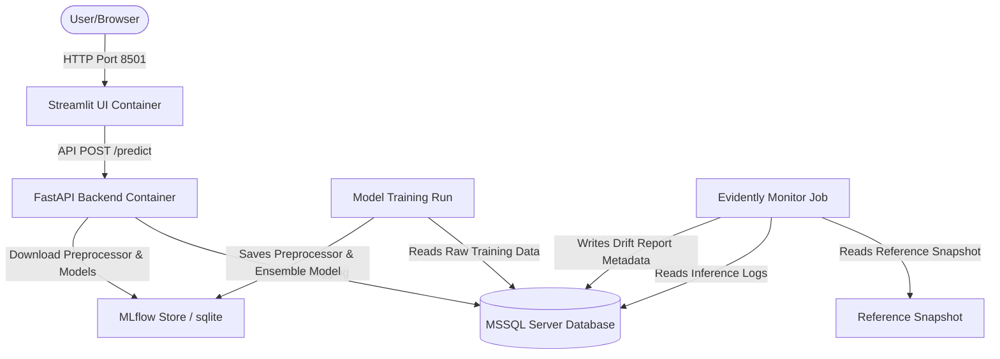

# 🏥 Health Insurance Premium Prediction MLOps Pipeline

An end-to-end MLOps pipeline designed to predict annual health insurance premiums. This system integrates feature engineering, ensemble modeling, Optuna-based hyperparameter tuning, experiment tracking with MLflow, containerized orchestration via Docker Compose, data drift monitoring with Evidently AI, and database logging using MSSQL.

---

## 🏗️ System Architecture



---

## 📂 Repository Structure

```
insurance-premium-prediction-mlops/
├─ config/
│  └─ config.yaml             # Central YAML configuration
├─ data/
│  ├─ raw/                    # Raw source dataset (Git-ignored, tracked by DVC)
│  ├─ processed/              # Processed model training features
│  └─ reference/              # Reference parquet data for drift baseline
├─ docker-compose.yml         # Container orchestration (FastAPI, UI, MSSQL server, Monitor)
├─ Dockerfile.api             # API container build definition
├─ Dockerfile.ui              # Streamlit dashboard container build definition
├─ DEPLOYMENT.md              # Deployment guide for AWS ECS/Fargate
├─ requirements.txt           # Python package dependencies
├─ sql/
│  └─ init_schema.sql         # MSSQL database schema initialization script
├─ scripts/
│  ├─ seed_database.py        # Database seeding utility
│  └─ prepare_reference_data.py # Reference baseline preparation script
├─ src/
│  ├─ app.py                  # FastAPI server entrypoint
│  ├─ config_loader.py        # Configuration loader with ENV expansion
│  ├─ database.py             # SQLAlchemy database access layer
│  ├─ ensemble.py             # Ensemble regressor class (XGBoost + LightGBM)
│  ├─ features.py             # Preprocessing & clinical feature engineering
│  ├─ inference.py            # Real-time and batch prediction execution
│  ├─ model_loader.py         # Model load utilities mapping from MLflow runs
│  ├─ schemas.py              # Pydantic schemas for request/response validation
│  └─ monitoring/
│     └─ drift_monitor.py     # Evidently AI drift detection job
├─ streamlit_app/
│  └─ app.py                  # Streamlit dashboard implementation
└─ README.md                  # This documentation file
```

---

## 🛠️ Main Pipeline Modules

* **Configuration:** [config.yaml](file:///H:/Insurance%20Project/insurance-premium-prediction-mlops/config/config.yaml) is the single source of truth for features, parameters, SQL setup, and drift metrics.
* **Feature Engineering:** [features.py](file:///H:/Insurance%20Project/insurance-premium-prediction-mlops/src/features.py) defines data parsing (blood pressure systolic/diastolic extraction), outliers clipping, and custom interaction variables (e.g. `risk_score`, `smoker_obese`, `hypertension`).
* **Model Training:** [train.py](file:///H:/Insurance%20Project/insurance-premium-prediction-mlops/src/train.py) handles model splits, preprocessor fitting, Optuna hyperparameter optimization, model ensembling ([ensemble.py](file:///H:/Insurance%20Project/insurance-premium-prediction-mlops/src/ensemble.py)), and registers artifacts to MLflow.
* **Database Access:** [database.py](file:///H:/Insurance%20Project/insurance-premium-prediction-mlops/src/database.py) persists runtime prediction metrics, latencies, database seeding logs, and reports data.
* **Inference Serving:** [inference.py](file:///H:/Insurance%20Project/insurance-premium-prediction-mlops/src/inference.py) handles log-transformed predictions. [app.py](file:///H:/Insurance%20Project/insurance-premium-prediction-mlops/src/app.py) runs the FastAPI endpoints validation via [schemas.py](file:///H:/Insurance%20Project/insurance-premium-prediction-mlops/src/schemas.py).
* **Drift Checker:** [drift_monitor.py](file:///H:/Insurance%20Project/insurance-premium-prediction-mlops/src/monitoring/drift_monitor.py) measures production logs drift compared to baseline data.
* **Streamlit UI:** [app.py](file:///H:/Insurance%20Project/insurance-premium-prediction-mlops/streamlit_app/app.py) serves as the front window for user metrics inputs and model accuracy summaries.

---

## ⚡ Quick Start (Local Environment)

### 1. Setup Virtual Environment and Install Dependencies (Windows Command Prompt - CMD)
```cmd
:: Create the virtual environment
python -m venv .venv

:: Activate the virtual environment in CMD
.venv\Scripts\activate

:: Install required packages
pip install -r requirements.txt
```

### 2. Configure Environment Variables
Create a local `.env` file (refer to `.env.example`):
```env
MSSQL_HOST=localhost
MSSQL_PORT=1433
MSSQL_DATABASE=InsuranceDB
MSSQL_USER=sa
MSSQL_PASSWORD=YourStrong!Passw0rd
```

### 3. Initialize Database and Seed Data
Make sure your MSSQL server is running, then seed the initial data:
```cmd
:: Run the schema initialization script in SQL Server using sql/init_schema.sql
:: Then seed data:
python scripts/seed_database.py
```

### 4. Create Baseline Reference Data for Drift
```cmd
python scripts/prepare_reference_data.py
```

### 5. Train Model
```cmd
python src/train.py
```

### 6. Run serving API
```cmd
uvicorn src.app:app --host 127.0.0.1 --port 8001 --reload
```

### 7. Run Streamlit UI Dashboard
In another terminal instance (ensure the virtual environment is activated there as well):
```cmd
streamlit run streamlit_app/app.py
```

---

## 🐳 Docker Compose (Multi-Container Run)

Build and run all services (MSSQL Server, db-init, FastAPI, Streamlit UI) together locally:

```cmd
:: Build and run containers
docker compose up -d --build

:: View logs
docker compose logs -f
```

The services will be exposed at:
* **FastAPI Server:** `http://localhost:8001/docs` (Swagger UI documentation)
* **Streamlit UI Dashboard:** `http://localhost:8501`

To run a weekly drift inspection using the compose network:
```cmd
docker compose run --rm drift-monitor
```

---

## 📈 MLflow Diagnostics UI

To monitor models, artifacts, parameters, and tuning runs inside MLflow, launch the UI panel referencing your database location:

```cmd
mlflow ui --backend-store-uri "sqlite:///H:/Insurance Project/insurance-premium-prediction-mlops/mlruns/mlflow.db"
```
Once started, navigate to `http://localhost:5000` in your web browser.

---

## ☁️ Production Deployment

For detailed configurations on migrating Docker containers to Amazon Web Services (AWS) using **ECR**, **ECS Fargate**, **Amazon RDS SQL Server**, and **Application Load Balancers (ALB)**, see the [DEPLOYMENT.md](file:///H:/Insurance%20Project/insurance-premium-prediction-mlops/DEPLOYMENT.md) guide.
